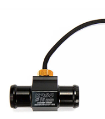
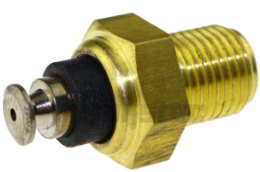
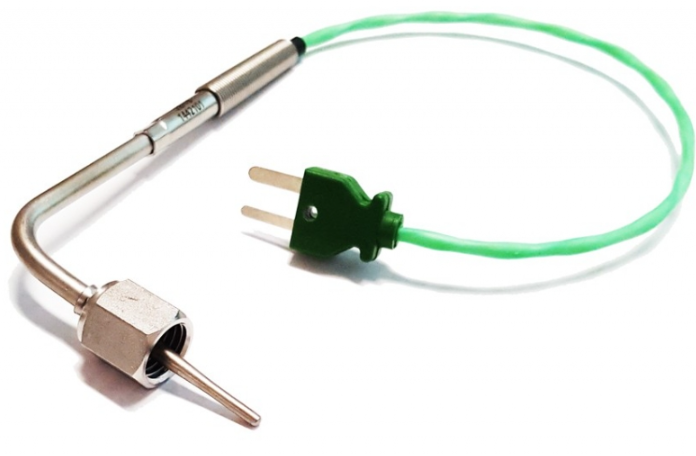
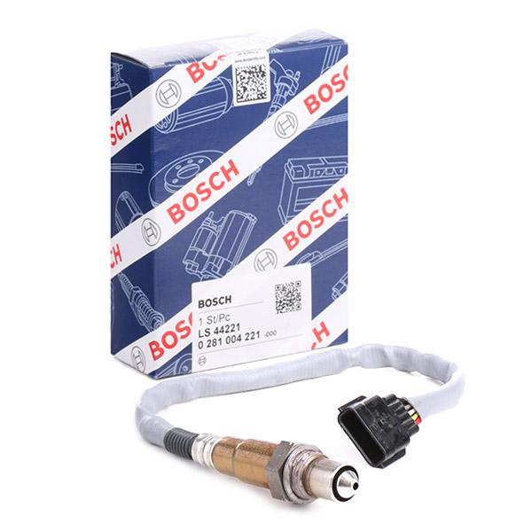
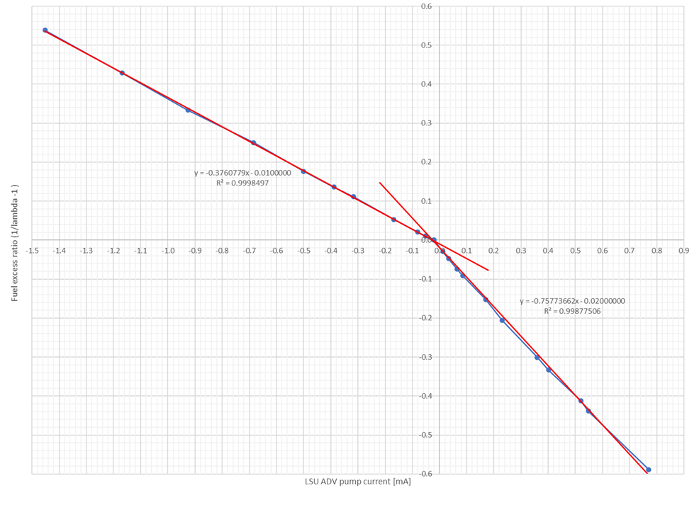

# Electronics overview -- I use these parts:
1. Temperature sensors -- as indicated by the name "RaceTemp"
2. Controller board
3. WiFi module -- for connection to the phone.     
4. Sat.Nav.(GPS) module and antenna for lap/split times, speed and acceleration
5. Ignition probe for engine RPM
6. Gyro/accelerometer: MPU9250
7. $\lambda$ or O2 wideband sensor
8. Knock sensor  (not yet implemented)  

You can of course add your own selection of other sensors -- see for example the pedal sensor in the Mech folder.  My plan:  

# 1. Temperature sensors  

  
NTC for water temp. Both these sensors has M10x1 (fine pitch) thread.   The one from KOSO includes also a hose adapter.  
The Rotax Max engine has a M10x1 threaded hole at the cylinder head cover (and does not need a hose adapter).  
A female flat cable lug can connect to the top of the sensor in the right picture.   
 
MAX6675 module 

Thermocouple for EGT: Mondokart's "Sondagas" with green wire works fine for me.
  

# 2. Controller board  
"WeAct Black Pill" with STM32F4 and a ST-link debugger.  
You can see the MCU pinout I use in STM32CubeMX (open the RaceTemp.ioc file).  
I have also used Arduino Nano and "Blue Pill" STM32F1.  Maybe I will also try ESP32 S3 and BLE  

# 3. WiFi module  
ESP01 (ESP8266) module.  
I have also used a HC06-module for Bluetooth SPP (in stead of WiFi). 
The code is still mostly compatible with HC06, but the ESP01 is better. 

# 4 Sat.Nav. receiver and antenna  
Ublox Neo M9N module.  
Ceramic patch antena, size 25x25 mm, active (w/amplifier), 28 dBi,  10 mA 3.3 to 5 V.  
The antenna can be placed inside the electronics box (if using a plastic box and the orientation is correct), or one can use an external antenna (via a coax. cable). 

Quote from ref. [1]: "There is no need for the antenna LNA gain to exceed 26 dB for use with u-blox receivers (at the RF input). With shorter
cables and a gain above 35 dB, an overload condition might occur on some receivers."

The antenna should have the ceramic side up and little obstructions towards the sky, and the metallic side down towards a ground plane.
I.e.: No cables or circuit boards (and little of other stuff) above the antenna.

**Neo M9N module vs. "RaceBox Mini" (or similar devices)**:

RaceChrono app on the phone can record simultaneous data from both RaceBox Mini and DIY devices like RaceTemp.
Temperatures, RPM, etc. will then come from RaceTemp, while navigation data will come from RaceBox Mini.

Advantages of RaceBox Mini:
1. Easier to use -- no wires, except USB cable for battery charging
2. Higher precision -- more accurate navigation data
3. Reliable connection to the phone -- DIY devices like HC06 or ESP01 might lose/drop the connection.

Advantages of Neo M9N module:
1. Lower price (approx $50, vs $200 for a RaceBox Mini)
2. One less battary to charge and maintain
3. RaceTemp with both a Sat.Nav. module and RPM probe can calculate the gear ratio (as speed/RPM)

# 5. Ignition probe for engine RPM  
This is just a wire and some protection diodes connected to one of the microcontroller's timer inputs.    

# 6. Gyro/accelerometer: MPU9250  
This worked OK until I disconnected and disabled it because "g" anyway will be calculated based on Sat.Nav.  
The code probably still works -- to enable it: uncomment the //#include "MPU9250.h" in the RaceTemp.c  

# 7. $\lambda$ or O2 wideband sensor  
  
I will use a Bosch part number LS44221 as shown in the picture and Bylund's LambdaShield with Bosch CJ125 chip.  
The code for this is included and enabled -- just hook it up and try! 
It is probably OK to leave it enabled in software even if you do not add the electronics and sensor.  
I prefer to present the results as "Fuel Excess" -- negative FuEx means lean (danger), positive FuEx is rich (safe). 
Preliminary target value for max power: 5 to 10% fuel excess while at 100 % throttle -- also depending on the exhaust gas temperature. 
Slightly more excess fuel at lower throttle.  

I will try to use this wideband O2-sensor: Bosch part number LS44221 (marked 226A41733R) as shown in the picture.  
Bosch LS44221 (LSU ADV) has a reasonable price, approx. 100 USD for a new one, and much less for a used.  
Other UEGO (universal exhaust-gas oxygen) sensors might also be compatible with this project.  
Bosch LSU4.9 from China have even lower cost, but I have not tried these.  

More documents are available online for the LSU4.9 than for the LSU ADV.  The main difference 4.9 vs ADV is supposed to be:
“The LSU ADV has no trimming resistor inside the connector what results in just 5 connector pins.  
Compared to LSU4.9, the LSU ADV has a wider working temperature range.”, quote from ref. [2]

The LS44221 is, according to ref [4], used in these cars (in case you look for a used one at the scrapyard):  

	MERCEDES-BENZ A-Class, B-Class, C-Class, CLA, GLA, Vito, Citan  
	NISSAN Qashqai II, Juke, Micra, Note, NV200, NV300, X-Trail  
	Renault CAPTUR, CLIO, ESPACE, SCENIC, KADJAR, MEGANE, TALISMAN, TRAFIC III  
 
The connector is “Yazaki 7283-8850-30” with this Pinout:  

	Pin 1: Red 	IP/APE		Pumping current (output signal, -1.35 to +1.4 mA, resp. for ?=0.65 and 5.0)  
	Pin 2: Yellow	VM/IPN		Virtual ground for both sensor cells (the reference voltage)  
	Pin 3: White	Uh-/H-		Heater neg (connect this to low-side power transistor)  
	Pin 4: Grey	Uh+/H+		Heater pos (connect this to VBAT = 10.8 to 16.5 V)  
	Pin 5: NC			(LSU 4.9 has a green wire to a trimming resistor)  
	Pin 6: Black	UN/RE 		Nernst voltage (connect this to the pump current regulator)  

The LSU ADV will be connected to a Bosch CJ125 chip.
CJ125 has two main output signals representing:
a) the "pump cell current" and  
b) the LSU's temperature  

  
The plot presented above is based on data from LSU ADV datasheet [2], it shows that 
the fuel excess ratio is proportional to (or a piecewise linear function of) something called "pump current". 
There is a fuel rich area to the left and in a lean area to the right. 
The sensor constant is approx. half in the rich area:  0.3761/0.7577  = 0.50.

The linear fit will be less good at extreme lean situations, thus one cannot expect the 
output to show -100% Fuel Excess if operating the sensor in air. 
Lean operation is normally not desired for racing engines with spark ignition -- my KZ2 race 
engine needs to operate slightly rich or else it will seize within minutes or even less.  

Fuel excess ratio and $\lambda$ can be calculated as: 	

	FuEx = min(-0.3761 Ip - 0.01,  -0.7577 Ip - 0.02) where Ip is pump current in mA.  
	$\lambda$ = 1 / (FuEx+1)  

The calculated FuEx and $\lambda$ are only accurate if LSU's temperature is maintained at approx. 785 degC.  
The LSU includes a resisive heating element that must be used to maintain that temperature. 
The software must implement a temperature controller. The LSU application manual includes guidelines 
for how to heat up the sensor after starting the engine -- too quick warm-up 
and/or water in the exhaust can damage the sensor.  

# 8. Knock sensor  
TPIC8101DWTR chip and 0261231176 sensor.  I did not yet write any code for this. 

# Other considerations  
## Electromagnetic noise
The engine ignition (on my go kart) causes a lot of electromagnetic noise. 
Therefore: All wires entering the circuit boards should (at entry) have both a 100 nF connected to GND and a TVS diode (also to GND). 
This will both protect the electronics and also increase accuracy.  

# List of references  
Ref. 1:	uBlox GNSS-Antennas_AppNote UBX-15030289 - R03.  
Ref. 2.	BOSCH Lambda Sensor LSU ADV/ADV pre Turbo. Downloaded from www.bosch-motorsport.com  
Ref. 4.	BOSCH Lambda oxygen sensors, aftermarket catalogue 2018/2019.  Downloaded from www.boschaftermarket.com

