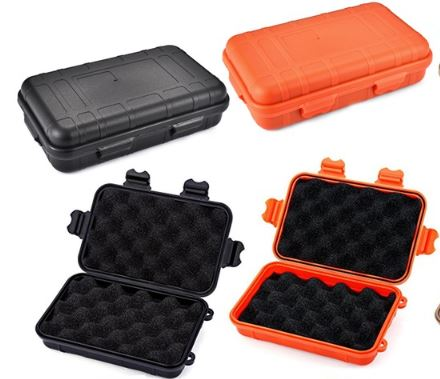
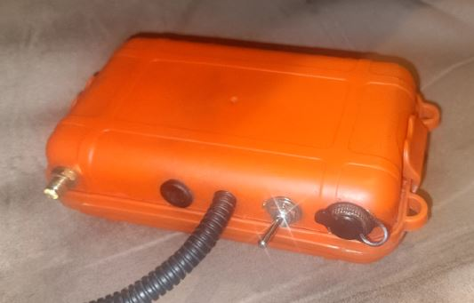
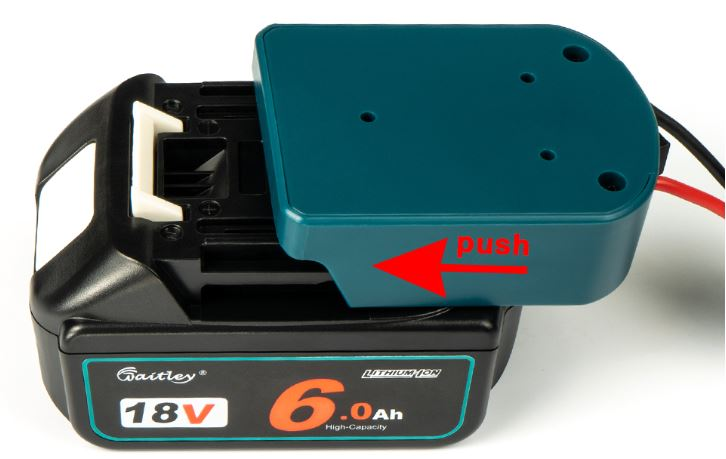
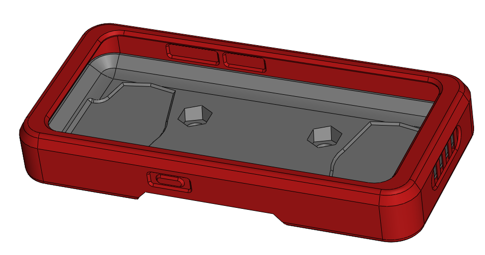
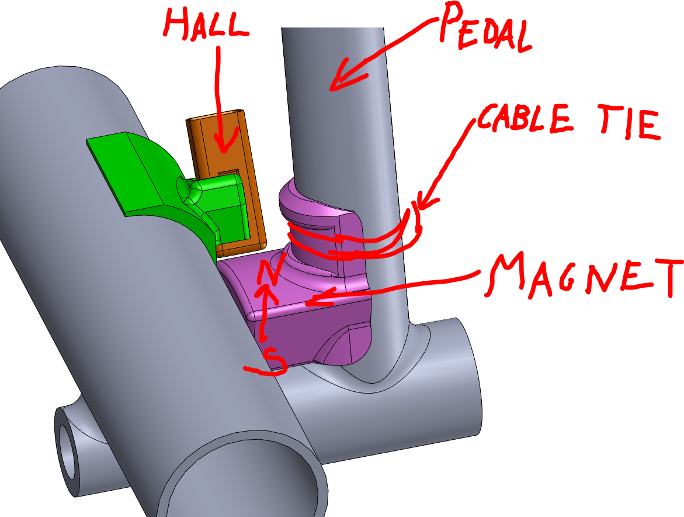

 
# Electronics Box  
    

I have a water proof box like this zip-tied under the front edge of my go kart seat.  I removed the foam and attached the electronics with velcro tape inside the box.  
This box is not ideal with respect to ESD protection, and the location is not ideal for the Sat.Nav. antenna, but it seems to work equally well as an external antenna at a higher/better location.  
I purchased the box here: https://www.aliexpress.com/item/1005002519049999.html 

# Battery  
The elctronics can be powered by a single 18650 LiPo cell, which can be located in the box together with the electronics. 
Here is a holder for 18650 cell: https://www.aliexpress.com/item/1005001660193629.html. 
I recommend using a cell with integrated over-discharge protection -- so that it will not be damaged in case one forgets to switch off the logger. 
However; the O2 sensor (Lambda) requires 12 V.  One can connect it to the start battery (if the kart/vehicle has one), but my kart did not have 12 V, 
so I use my wrench/drill battery instead -- i mean; as long as I do not screw or drill while driving; the battery is idle and free to use for the electronics...     
  
I purchased my battery holder here:  https://www.aliexpress.com/item/1005004578692099.html and attached it to the seat.  

# Phone bracket
  
3D-printed phone bracket used for holding an Oscal S80 on a Sodikart steeringwheel in 2023.  
The red part is printed in soft TPU.  
The black parts are printed in hard ABS or PETG. 
Solidworks files are in the Mech folder.

# Pedal position sensor
  
3D-printed pedal sensor used on a TopKart Blue Eagle in 2016.  It gives a linear ouptput, approx 0.4 to 2.9 V over the pedal stroke. 
The magnet is fixed to the pedal and moves past the tip of a Hall chip with analogue output. 
The north pole of the permanent magnet points towards the sensor chip when the pedal is half pressed. 
The Hall chip senses magnetic flux through the chip -- in the direction of pedal movement.  
The sleeve for the Hall chip is easily clipped on/off to the bracket for easy installation/removal -- without using an electrical connector. 
Solidworks files are in a .zip-file the Mech folder. 
